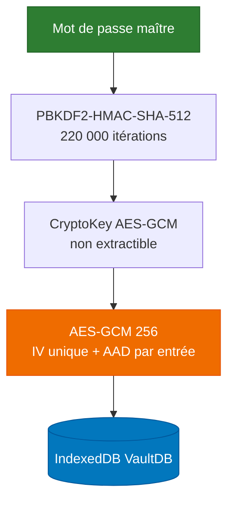

# 🔐 CryptoKeep

**Coffre-fort de mots de passe 100 % local, chiffré dans le navigateur.**

<p align="center">
  
  
  
  
</p>

> **Sur le nom.** Le projet s'appelle **CryptoKeep**. `vault-personal` est le
> nom du dossier local et de l'ancien site de documentation ; ce n'est pas le
> nom du projet. Le dépôt publié est
> [`Giscolab/CryptoKeep`](https://github.com/Giscolab/CryptoKeep).

---

## Ce que c'est

Une page web que vous servez vous-même sur `127.0.0.1`. Vos mots de passe sont
chiffrés en AES-GCM 256 avec une clé dérivée de votre mot de passe maître, et
stockés dans IndexedDB. **Aucun compte, aucun serveur applicatif, aucune
synchronisation.** La seule fonction réseau est la vérification de compromission
(HIBP) : elle est désactivée par défaut et n'émet rien tant que vous ne l'avez
pas explicitement activée.

| | |
|---|---|
| Dérivation de clé | PBKDF2-HMAC-SHA-512, **220 000 itérations** |
| Chiffrement | AES-GCM 256, IV de 12 octets unique par chiffrement, AAD par entrée |
| Clé maître | `CryptoKey` Web Crypto **non extractible** |
| Stockage | IndexedDB, format versionné (v1 historique, v2 courant) |
| Dépendances | **aucune** — pas de framework, pas de CDN |

---

## Documentation

**Commencez par ici. Ces documents décrivent ce que le code fait réellement.**

| Document | Contenu |
|---|---|
| [`SECURITY.md`](SECURITY.md) | Protections implémentées, **limites réelles**, signalement de vulnérabilité |
| [`docs/LANCEMENT-SECURISE.md`](docs/LANCEMENT-SECURISE.md) | Lancement Windows, développement local, tests |
| [`docs/FONCTIONS-IMPLEMENTEES.md`](docs/FONCTIONS-IMPLEMENTEES.md) | Inventaire vérifié, avec le test qui prouve chaque ligne |
| [`docs/FONCTIONS-PREVUES.md`](docs/FONCTIONS-PREVUES.md) | Ce qui est prévu, envisagé, ou écarté — et pourquoi |
| [`docs/FORMATS-DE-COFFRE.md`](docs/FORMATS-DE-COFFRE.md) | Formats v1 et v2, bornes de validation |
| [`docs/MIGRATIONS.md`](docs/MIGRATIONS.md) | Sauvegarde, restauration, migrations, dépannage |
| [`THREAT_MODEL.md`](THREAT_MODEL.md) | Modèle de menace détaillé |
| [`docs/2FA-WEBAUTHN-AUTOFILL.md`](docs/2FA-WEBAUTHN-AUTOFILL.md) | Pourquoi 2FA et remplissage automatique restent désactivés |
| [`docs/DECISION-APPLICATION-DESKTOP.md`](docs/DECISION-APPLICATION-DESKTOP.md) | Application desktop : options, critères, **non tranché** |
| [`docs/MODULES-HISTORIQUES.md`](docs/MODULES-HISTORIQUES.md) | Modules conservés mais remplacés |
| [`CHANGELOG.md`](CHANGELOG.md) | Journal par lot |
| [`docs/launcher.md`](docs/launcher.md) | Décisions techniques du lanceur |
| [`tests/browser/README.md`](tests/browser/README.md) | Parcours navigateur, sans dépendance |

---

## Lancement

### Windows — recommandé

```bat
start_vault_secure.bat
```

Puis **1**. Le lanceur démarre le serveur local et ouvre Edge ou Chrome sur un
**profil dédié et persistant** (`%LOCALAPPDATA%\CryptoKeep\browser-profile`).

`start_vault_local.bat` est le lanceur historique, conservé.
Il n'existe **pas** de `start.bat`.

### macOS, Linux

```bash
python3 scripts/secure_local_server.py
```

Puis ouvrez `http://127.0.0.1:8000/index.html`.

### Deux règles

> **L'accès local est en HTTP EN CLAIR.** Il n'y a **aucun TLS** : ne décrivez
> jamais cette adresse comme `https://`. La confidentialité au repos repose
> exclusivement sur le chiffrement AES-GCM des données, pas sur le transport.
> Le serveur n'écoute que sur l'interface de bouclage.

> **Ne lancez jamais le coffre en navigation privée.** L'application dépend
> d'IndexedDB et de `localStorage` : en mode éphémère, le coffre est **détruit
> à la fermeture du navigateur**.

Détails : [`docs/LANCEMENT-SECURISE.md`](docs/LANCEMENT-SECURISE.md).

---

## Chaîne de chiffrement



---

## Structure réelle du projet

```
CryptoKeep/
├── index.html                  # L'application, une seule page
├── scripts/
│   ├── app.js                  # Point d'entrée
│   ├── core/
│   │   ├── crypto/             # pbkdf2.js, aes-gcm.js, runtime.js
│   │   ├── storage/            # manager.js, vault-format.js, import, sauvegarde
│   │   └── vault/              # manager.js, entry-operations.js, destruction
│   ├── security/               # verrouillage, politique, audit, HIBP
│   ├── ui/                     # écrans et fenêtres
│   ├── utils/                  # presse-papiers, filtres, préférences
│   ├── vendor/                 # Chart.min.js (seul fichier tiers, non modifié)
│   └── secure_local_server.py  # serveur local avec en-têtes de sécurité
├── public/                     # CSS, thèmes, icônes
├── tests/                      # 33 suites Node + parcours navigateur
├── docs/                       # documentation
├── start_vault_secure.bat      # lanceur recommandé
└── start_vault_local.bat       # lanceur historique, conservé
```

---

## Tests

```bash
npm test              # suite complète — sortie non nulle en cas d'échec
npm run test:security # non-régression sécurité
npm run test:syntax   # syntaxe de TOUS les fichiers JS, historiques inclus
npm run test:python   # compilation des scripts Python
npm run test:browser  # parcours navigateur complet, sans dépendance installée
npm run lint          # ESLint — 0 erreur exigée
```

Le parcours navigateur pilote Edge, Chrome ou Chromium **déjà installé**, via le
Chrome DevTools Protocol, avec les seuls modules natifs de Node. Rien n'est
téléchargé. Voir [`tests/browser/README.md`](tests/browser/README.md).

---

## Feuille de route

Le projet n'annonce pas de dates. Il avance par lots, livrés puis audités. Ce
qui est prévu, envisagé ou écarté est dans
[`docs/FONCTIONS-PREVUES.md`](docs/FONCTIONS-PREVUES.md).

---

## Contribuer

Voir [`CONTRIBUTING.md`](CONTRIBUTING.md).

- Signaler un bug : [issues](https://github.com/Giscolab/CryptoKeep/issues)
- Vulnérabilité : voir [`SECURITY.md`](SECURITY.md)

> Les exports HTML de journaux (`export-log.html`) sont générés localement et ne
> doivent pas être commités. `export_log.py` reste conservé pour les produire à
> la demande.

---

<p align="center">
  Développé par <b>Franck</b> — <a href="https://github.com/Giscolab/CryptoKeep">GitHub</a> — licence MIT
</p>

> ⚠️ **Votre mot de passe maître n'est stocké nulle part.** Il n'existe ni
> récupération, ni question de secours, ni porte dérobée. Sa perte rend le
> coffre définitivement inaccessible. **Exportez régulièrement votre coffre**
> — voir [`docs/MIGRATIONS.md`](docs/MIGRATIONS.md).
